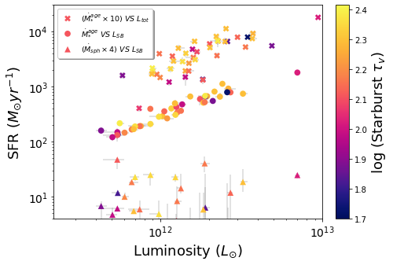

<h1 align="center">Hi, I'm Charalambia! </h1> 

  

 

💻 Currently working on **SMART** 

👀 Passionate researcher in the broad areas of **Computational and Applied Mathematics**, as well as **Galaxy Evolution**

✨ Turning my hobby into my job and vice versa

🔭 How to find my scientific works: &thinsp; 

⚡ How to watch my videos: &thinsp; 

📬 How to reach me: &thinsp;  

 
 
 

  

 

Fields of Scientific Interest
=============
Computational mathematics

Mathematical and computational (in-silico) modelling

Markov chain Monte Carlo (MCMC) model fitting

Bayesian inference

Finite element method

 

More about me
=============
For more information about me, please read my [C.V.](https://github.com/ch-var/ch-var/blob/main/CV%20-%20Charalambia%20Varnava.pdf)!

